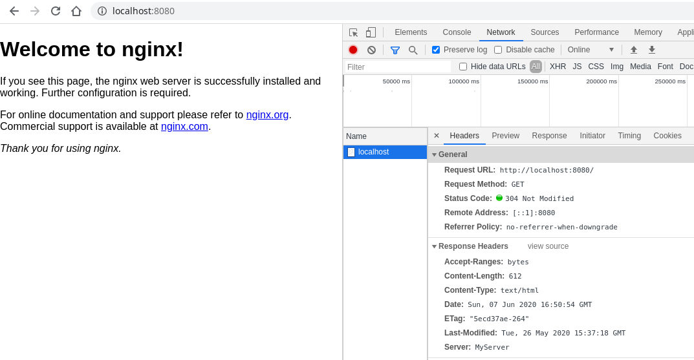

# nginx-more-header-module
[](https://cloud.drone.io/bkayranci/nginx-more-header-module)

## DESCRIPTION
The headers-more-nginx-module module compilation automatize for different Nginx versions.


## INSTALLATION
The module can be compiled or downloaded binary.

[Binaries](https://github.com/bkayranci/nginx-more-header-module/releases)

1. Download `ngx_http_headers_more_filter_module.so`
2. Load module to Nginx with [load_module](https://nginx.org/en/docs/ngx_core_module.html#load_module)


## CONFIGURATION
Check official document for configurations.

[headers-more-nginx-module](https://github.com/openresty/headers-more-nginx-module)


## COMPILATION

### Dockerfile
```shell
docker build --build-arg nginx_version=1.19.0 --build-arg more_header_module_version=v0.33 -t bkayranci/nginx-more-header-module .
```

### docker-compose
```shell
docker-compose build
```

### DroneCI
Check it on [DroneCI Cloud](https://cloud.drone.io/bkayranci/nginx-more-header-module) or [Github Releases](https://github.com/bkayranci/nginx-more-header-module/releases)


## EXAMPLES

### Example Dockerfile
```dockerfile
FROM bkayranci/nginx-more-header-module:nginx-1.19.0_more-header-module-v0.33 AS module
FROM nginx:1.19.0-alpine

COPY --from=module /modules /etc/nginx/modules
COPY default.conf /etc/nginx/conf.d/default.conf
RUN echo 'load_module "/etc/nginx/modules/ngx_http_headers_more_filter_module.so";' > /etc/nginx/nginx.conf.temp
RUN cat /etc/nginx/nginx.conf >> /etc/nginx/nginx.conf.temp
RUN mv /etc/nginx/nginx.conf.temp /etc/nginx/nginx.conf
```

### Example Project
```shell
git clone https://github.com/bkayranci/nginx-more-header-module.git
cd nginx-more-header-module/example
docker-compose up -d
```

### Screenshot



## LICENSE
[GNU GPLv3](./LICENSE)
